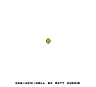

# cgb-acid-hell
This is a cleaned up and documented version of the cgb-acid-hell test created by mattcurie. The test
is programmed in a very unorthodox way that abuses edge cases/quirks in the hardware (for example with
the halt instruction and interrupts), and relies on constant manipulation of the scroll and LCDC registers
every scanline to control what graphics from the tilemap are drawn to the screen.

Look at the code if you dare 😈

## Reference Image
To pass this test an emulator should generate output identical to the image below:

[Reference photo from a real device](https://github.com/mattcurrie/cgb-acid-hell/raw/main/img/photo.jpg)

## ROM Download
This is not a day care.

## Emulator Requirements
Not telling. 🤫

## Guide
Nope.
